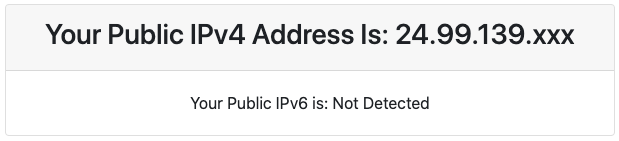
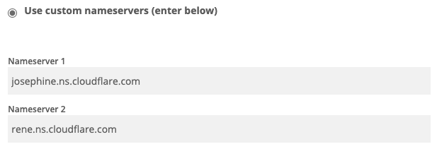

Google Photos will end its free unlimited storage on June 1st.  Google Drive storage prices $19.99/year for 100GB.  I'm broke all the time.  And yes, I'm attracted to free stuff so are you.

What do I have left:
* An old laptop
* 1 128GB SSD + 1 500GB HDD
* Empty wallet
* My brain

I had spent my entire 2 days to find the best way to host my own cloud on my old laptop.  After a few researches, I ended up with Nextcloud.  Nextcloud is free, open source, large community.  There are 2 methods, classic and snap, to install on Ubuntu.  I think the classic way is good for me just because I failed using snap.  You can easily find help on the classic way.

I picked Ubuntu 20.04 because it's basically recommended by Nextcloud.  No particular methods are perfect for anyone.  You should use my article as references.

### **Why don't I point domain directly to my <font color="red">public IP address</font>?** 

- You can try to point a domain to your public IP address, and go to [dnsdumpster.com](https://dnsdumpster.com/) you can easily trace where your server is.  It's risky if others can see my real IP.  So for security purpose, I will use <font color="red">Cloudflare DNS servers</font> to hide my IP.  We will also obtain SSL Certificate for our server later.

Let's make it clear here:

* **<font color="red">Public IP Address or Public IP</font>**: provided by my ISP, and it's linked to the MAC address of the router.  It's stable as long as my router is stable.  Public IP doesn't change even you turn your modem and router over night.  You may request your ISP to change.  You can find it at [whatismyip.com](https://www.whatismyip.com/what-is-my-public-ip-address/).  Mine is <font color="red">24.99.139.xxx</font> You guess the rest.  Take your time!

  

* **<font color="red">Server IP Address or Server IP</font>**: you can type `ip a` in your Ubuntu Terminal to find it.  My server IP is <font color="red">192.168.0.113</font>

  


I will try my best to explain what I was curious before I successfully installed Nextcloud.  This article is the combination of what I have learned from other articles and my own practices. I won't lonely talk about Nextcloud in this article. Have fun!

## 1. Install The Latest Ubuntu Version

I don't care how you install Ubuntu.  Just install it.

## 2. Register Free Domain With Freenom

1. Register a new account if you don't have one at [freenom.com](https://www.freenom.com)
2. Under <font color="red">Service</font> dropdown menu, pick <font color="red">Register a New Domain</font>
3. Now you can type your favorite domain name. Click <font color="red">Check Availability</font>
4. Click <font color="red">Get it now</font> on the domain you like as long as it's free (I'm broke). Then click <font color="red">Checkout</font> on top right corner
6. At checkout page, pick <font color="red">12 Months @ FREE</font> or whatever you like
7. Click <font color="red">Continue</font> and <font color="red">Complete Order</font> on next page.
7. Go to Services > My Domains > Manage Domain > Management Tools > Use custom nameservers (enter below).  You should see 5 blank fields.  Leave them there.

It may take a while to make your domain appear on THE INTERNET.  Be patient even you're broke.

## 3. Setup Cloudflare

Why?  I've answered it above.

1. Register a new account if you don't have one

2. You should see <font color="red">Add site</font> button after login,  Enter your website address and click <font color="red">Add site</font>

3. Pick <font color="red">FREE</font> plan next page and wait for it scanning domain's DNS records.

4. There should be **NO** DNS records.  Click <font color="red">Add Record</font> button. Add 2 DNS records.

   | Type | Name | IPv4 address                                | TTL  |
   | ---- | ---- | ------------------------------------------- | ---- |
   | A    | @    | Your Public IP Address (Mine 24.99.139.xxx) | Auto |
   | A    | www  | Your Public IP Address (Mine 24.99.139.xxx) | Auto |

5. On next page, copy both Cloudflare's nameservers and paste them into Nameserver 1 and Nameserver 2 on Freenom site.  Click 

   

6. Click <font color="red">Change Nameservers</font> to save.

7. Go back to Cloudflare site and click <font color="red">Done, check nameservers</font>.  Turn on all services on next page.

It may take 24 hours to get nameserver updates.

## 4. Port Forwarding (Setup NAT)

Go to [portforward.com](https://portforward.com/router.htm), this website have a great amount of mostly every router.

### My TP-Link Archer A7 V5

1. Advanced > NAT Forwarding > Virtual Servers

2. Click Add:

   | Service type | External port | Internal IP                            | Internal port | Protocol |
   | ------------ | ------------- | -------------------------------------- | ------------- | -------- |
   | Nextcloud    | 80            | Server IP Address (Mine 192.168.0.113) | 80            | ALL      |
   | Nextcloud    | 443           | Server IP Address (Mine 192.168.0.113) | 443           | ALL      |

## 5. Install SSH Server & Connect to SSH over LAN

### 1. Install SSH Server on Your Host Laptop

SSH Server allows other devices to remote your device, transfer data through command line.  After setting up successfully your self-host server, you definitely want to hide it somewhere away from other sights.  To maintain your server, you only need to connect it through SSH.

1.  Open your terminal by using <font color="red">Ctrl+Alt+T</font> keyboard shortcut or clicking on the terminal icon.  Type the lines below to install <font color="red">openssh-server</font> package.

`sudo apt update`
`sudo apt install openssh-server -y`

Enter your password to continue the installation.

2.  The SSH service will start automatically after finishing the installation.  You can verify that the SSH server was installed successfully by typing the following command:

`sudo systemctl status ssh`

It should display <font color="red">Active: active (running)</font>

3.  Now, to allow others to remote your device, you must open open SSH port on your system firewall.

`sudo ufw allow ssh`

- <font color="red">ufw</font> is firewall configuration tool on Ubuntu

### 2. Connect to SSH Server From SSH Clients Over LAN

By default, Linux and macOS systems have SSH clients installed.

1. On <font color="red">Linux</font> or <font color="red">macOS</font> system, enter the following command:

`ssh username@server_ip_address`

2. Answer what the system prompts you.

If you are using Windows, [this will help you](https://www.google.com/search?safe=strict&sxsrf=ALeKk023VLQC9OJfET8H7NMb9KA_M3JEAA%3A1609912146473&ei=Uk_1X7erHIbZ5gK6t6yQDQ&q=++Using+SSH+in+PuTTY+on+Windows).

<font color="red">From now on, we can do any tasks remotely from any other devices with SSH client installed.</font>

## 6. Install Apache

Enter the following commands:

`sudo apt-get install -y apache2 apache2-utils`
`sudo systemctl enable apache2`

To check if the apache web server works, put your <font color="red">server ip</font> in your browser.  Your browser will display <font color="red">**Apache2 Ubuntu Default Page**</font>

## 7. Install PHP 7.4

Enter the following commands to install PHP and its dependencies:

`sudo apt-get install php7.4 libapache2-mod-php7.4 php7.4-mysql php-common php7.4-cli php7.4-common php7.4-json php7.4-opcache php7.4-readline -y`

And this too:

`sudo apt-get install php-imagick php7.4-common php7.4-mysql php7.4-fpm php7.4-gd php7.4-json php7.4-curl php7.4-zip php7.4-xml php7.4-mbstring php7.4-bz2 php7.4-intl php7.4-bcmath php7.4-gmp -y` 

Enter the following command to restart apache2:

`sudo systemctl restart apache2`

## 8. Install MariaDB

MySQL or MariaDB databases are the recommended database engines for Nextcloud. 

1. Enter the following command to install MariaDB dependencies,

`sudo apt-get install mariadb-server mariadb-client php-mysql`

2. In order to use Emojis on your Nextcloud server with MySQL database, you need to enable Barracuda type.  Create a file by typing the line below into your terminal:

`sudo nano /etc/mysql/conf.d/00-innodb.cnf`

3. Enter the following lines into <font color="red">00-innodb.cnf</font> file:

````[mysqld]
innodb_large_prefix=true
innodb_file_format=barracuda
innodb_file_per_table=1```
````

4. Use <font color="red">Ctrl+X</font> keyboard shortcut, type <font color="red">Y</font> and <font color="red">Enter</font> to save file.

5. Restart MariaDB:

`sudo systemctl restart mariadb`

6. Secure MariaDB Database:

`sudo mysql_secure_installation`

* It will prompt you to enter password twice.  For the remaining questions, enter `y` for yes.

## 9. Create Nextcloud Database and Database User.

1.  Login to the MySQL with the password you already created:

`sudo mysql -u root -p`

2. Create a new database called <font color="red">nextcloud</font>:

`CREATE DATABASE nextcloud;`

3. Create a new user <font color="red">ncroot</font> with command:

`CREATE USER 'ncroot'@'localhost' IDENTIFIED BY 'your_new_password';`

* <font color="red">your_new_password</font>: use your own strong password. 

3. Grant new user full permissions to the database:

`GRANT ALL ON nextcloud.* TO 'ncroot'@'localhost' IDENTIFIED BY 'user_password_here' WITH GRANT OPTION;`

4. Save changes and exit

`FLUSH PRIVILEGES;`
`EXIT;`

* <font color="cyan">You'll use database name **_nextcloud_**, username **_ncroot_** and **_your_new_password_**  in step 17</font> 

## 10. Download Latest Nextcloud Release

Go to [Nextcloud Install]( https://Nextcloud.com/install/#instructions-server 9) to find the latest stable version.  The latest version at the time I write this article is <font color="red">20.0.4</font>

1. Take the version number and use the following command to download:

`wget https://download.Nextcloud.com/server/releases/Nextcloud-20.0.4.zip`

2. Now unpack Nextcloud in the current directory after downloading:

`unzip Nextcloud-20.0.4.zip`

3. Move the directory to the web server directory:

`sudo mv Nextcloud /var/www/`

4. Give <font color="red">/var/www/Nextcloud</font> directory ownership to www-data:

`sudo chown -R www-data:www-data /var/www/Nextcloud`

## 11. Apache2 Site Configuration

This file will control how users access Nextcloud content.  Use the following command:

`sudo nano /etc/apache2/sites-available/Nextcloud.conf`

Copy and paste the following lines into <font color="red">Nextcloud.conf</font> file.  Adjust  <font color="red">your-domain-name.com</font> to your registered domain name.

Use <font color="red">Ctrl+X</font> keyboard shortcut to exit, and enter Y to save.

```
<VirtualHost *:80>
     ServerAdmin admin@example.com
     DocumentRoot /var/www/Nextcloud/
     ServerName your-domain-name.com
     ServerAlias www.your-domain-name.com
  
     Alias /Nextcloud "/var/www/Nextcloud/"

     <Directory /var/www/Nextcloud/>
        Options +FollowSymlinks
        AllowOverride All
        Require all granted
          <IfModule mod_dav.c>
            Dav off
          </IfModule>
        SetEnv HOME /var/www/Nextcloud
        SetEnv HTTP_HOME /var/www/Nextcloud
     </Directory>

    <IfModule mod_headers.c>
      Header always set Strict-Transport-Security "max-age=15552000; includeSubDomains"
    </IfModule>
    
     ErrorLog ${APACHE_LOG_DIR}/error.log
     CustomLog ${APACHE_LOG_DIR}/access.log combined
</VirtualHost>
```

## 12. Enable Nextcloud, Apache Modules and Configure Server

### 1. Enable Nextcloud and Apache

Copy everything below and paste into your terminal.  It should run one by one automatically.

```
sudo a2ensite Nextcloud.conf
sudo a2enmod rewrite
sudo a2enmod headers
sudo a2enmod env
sudo a2enmod dir
sudo a2enmod mime
sudo a2enmod setenvif
sudo a2enmod ssl
sudo a2ensite default-ssl
```

### 2. Configure Server

Set the <font color="red">ServerName</font> directive globally, write into file:

`sudo nano /etc/apache2/conf-available/servername.conf`

Copy the following line into <font color="red">servername.conf</font> and save it.

````
ServerName localhost
````

Enable <font color="red">servername.conf</font>:

`sudo a2enconf servername.conf`

Restart Apache:

`sudo systemctl restart apache2`

Check configuration. The output should be: <font color="red">Syntax OK</font>

`sudo apache2ctl -t`

Set the trusted domain for Nextcloud.  Run:

`sudo nano /var/www/Nextcloud/config/config.php`

Copy and paste the following lines:
```
'trusted_domains' =>
array (
	0 => 'localhost',
	1 => 'domain.com',
	2 => 'www.domain.com',
),
```

* <font color="red">localhost</font> allows access from LAN with private IP address
* <font color="red">domain.com</font> allows to access from anywhere out of your LAN

# 13. Install Redis Memory Cache

To improve Nextcloud server performance with memory cache. 

Run the following line install <font color="red">redis-server</font>

`sudo apt install redis-server`

Install the PHP extension for connection to Redis.

`sudo apt install php-redis`

Next, adjust the Nextcloud configuration file:

`sudo nano /var/www/Nextcloud/config/config.php`

Add the following lines before <font color="red">);</font> line and save it:
```
'memcache.distributed' => '\OC\Memcache\Redis',  
'memcache.local' => '\OC\Memcache\APCu',
'memcache.locking' => '\OC\Memcache\Redis',
'redis' => array(
    'host' => 'localhost',
    'port' => 6379,
),
```

Restart Apache:

`sudo systemctl restart apache2`

# 14. Let's Encrypt SSL Certificates

Before installing Let's Encrypt SSL Certificates, you need to open port 80 and 443 on your router to your server ip address. (Go to step 4)

If you're done with port forwarding, it's time to install Certbot, use the commands:

`sudo apt-get update`
`sudo apt-get install python3-certbot-apache`

Request for a certificate:

`sudo certbot --apache`

1. Enter your <font color="red">email address</font>.
2. When it prompts which domain to obtain SSL certificate, leave <font color="red">blank</font> and press <font color="red">Enter</font> to select both domains.
3. Pick option <font color="red">2</font> to redirect all traffic over **HTTPS**:
```
Please choose whether or not to redirect HTTP traffic to HTTPS, removing HTTP access.
1: No redirect - Make no further changes to the webserver configuration.
2: Redirect - Make all requests redirect to secure HTTPS access. Choose this for
new sites, or if you're confident your site works on HTTPS. You can undo this
change by editing your web server's configuration.
```

### Renew SSL Cert Automatically With Crontab

Set up crob job to automatically renew the certificates:

`sudo crontab -e`

Add the following line at the end of your file, the ideal period to review is at least once per day.

```
0 1 * * * /usr/bin/certbot renew & > /dev/null
```

## 15. Secure Nextcloud of Apache:

Run the following command:

`sudo nano /etc/apache2/sites-available/Nextcloud-le-ssl.conf`

Add the follwing lines before <font color="red"></ Directory></font>
```
<IfModule mod_headers.c>
	Header always set Strict-Transport-Security "max-age=15552000; includeSubDomains"
	Header always set Refferer-Policy "no-referrer"
</IfModule>
```

Restart server again

`sudo systemctl restart apache2`

## 16. Redirect Apache2 Webpage To Nextcloud Dashboard

Run the following command:

`sudo nano /var/www/html/index.html`

Replace current <font color="red">META</font> tag with the following <font color="red">META</font> tag:

```
<META HTTP-EQUIV="Refresh" CONTENT="2;URL=https://www.your-domain-name.com/">
```

## 17. Configure Nextcloud

Your FREE website address should be running by now.

Enter username and password to register admin account.

* Database user: <font color="red">ncroot</font>
* Database password: <font color="red">your_new_password</font>
* Database name: <font color="red">nextcloud</font>
* Leave localhost as it is and leave Install Recommended Apps checked

Click <font color="red">Finish Setup</font> and be patient.

## More:

### Look for logs

`sudo cat /var/log/apache2/error.log`